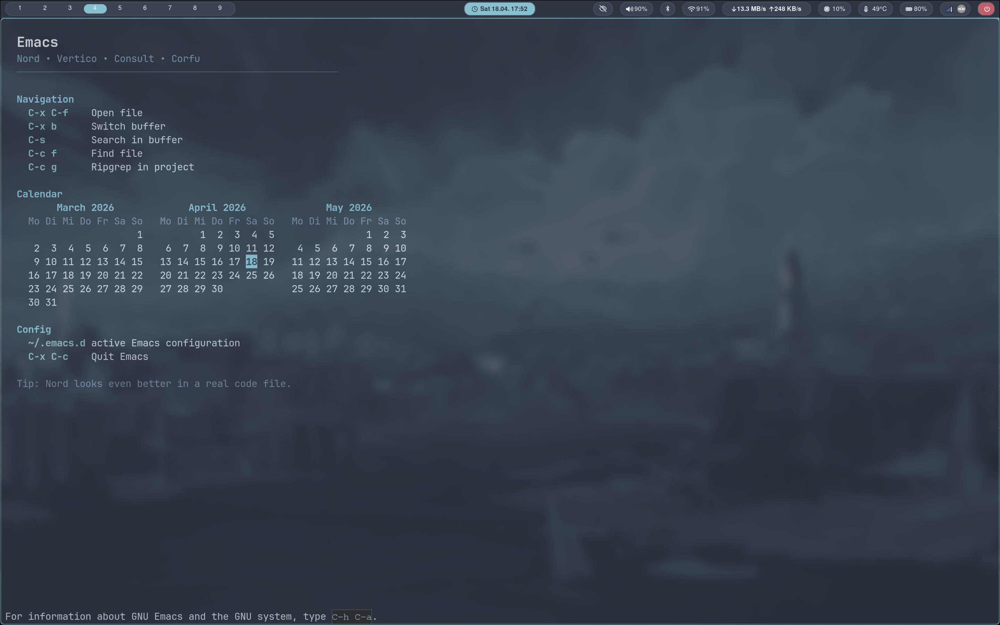

# Emacs

A clean Emacs setup for my dotfiles, built around the Nord theme with a lightweight completion and search workflow.

## Features

- Nord theme
- Vertico for minibuffer completion
- Consult for searching and navigation
- Corfu for in-buffer completion
- Custom start page
- Transparent frame styling
- Simple file and project workflow

## Structure

- `emacs/init.el` – main Emacs configuration
- `emacs/early-init.el` – early startup settings
- `emacs/themes/` – local theme files

## Included tools

### Nord
Provides the overall color theme and UI styling.

### Vertico
Adds a compact vertical completion UI in the minibuffer.

### Consult
Adds useful commands for searching, buffer switching, file lookup, and project grep.

### Corfu
Provides popup completion inside buffers.

## Common keybindings

- `C-x C-f` – open file
- `C-x b` – switch buffer
- `C-s` – search in current buffer
- `C-x d` – open Dired
- `C-x C-c` – quit Emacs

## Startup page

The setup includes a custom startup page instead of the default GNU Emacs welcome screen.

It is designed to:
- look cleaner than the default screen
- match the Nord styling
- provide a small overview of useful commands
- optionally show extra widgets like a calendar

## Notes

This setup uses the local dotfiles configuration rather than relying only on package defaults.

If Emacs does not load the expected config, make sure the active config points to this dotfiles setup.

## Install

Typical setup with symlinks:

- `~/.emacs.d/init.el` -> `dotfiles/emacs/emacs/init.el`
- `~/.emacs.d/early-init.el` -> `dotfiles/emacs/emacs/early-init.el`

## Goal

The goal of this setup is not to build a huge Emacs distribution, but to keep Emacs:
- clean
- readable
- fast enough
- pleasant to use every day
